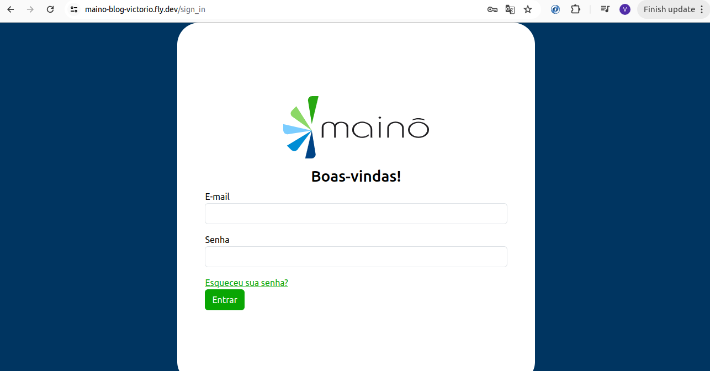
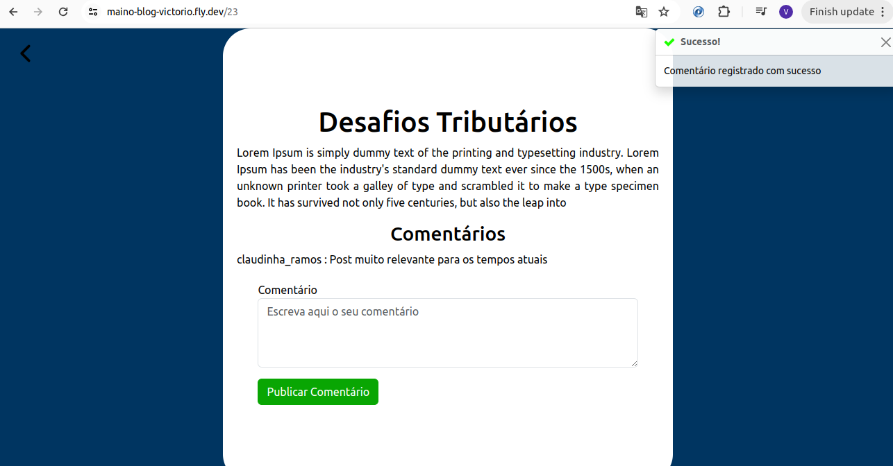

# Maino Blog
Esse é um blog feito em Ruby On Rails, PostgresSQL e Redis feito para o Desafio Backend da Mainô. A aplicação pode ser usada rodando Docker. O blog pode ser visto no endereço <a src="https://maino-blog-victorio.fly.dev/">https://maino-blog-victorio.fly.dev/</a> 

# Tutorial das Funcionalidades
O blog possui 12 funcionalides principais,cujos requisitos foram dados pela Mainô e que estão demonstradas no tutorial abaixo.

# 1) Os posts publicados devem ter paginação ao atingirem 3 publicações, onde o 4º post irá para a página 2 e daí em diante, ou seja, cada página deverá ter até 3 posts

Na página inicial da aplicação, o usuário consegue ver e ler todos os posts do blog sem precisar estar cadastrado. Os posts estão paginados, com 3 posts por página como requisitado

# 2) Fazer comentários anônimos

Um usuário é capaz de ler e comentar qualquer post sem precisar estar cadastrado. Para comentar, basta escrever na caixa de texto e apertar em publicar que seu comentário aparece para você e outros usuários, ressaltando que um comentário deve ter no mínimo 10 caracteres para ser publicado e o sistema faz essa validação (o alerta é mostrado pelo usuário por meio de um toaster no lado direito da tela). Se um usuário escrever um comentário com menos de 10 caracteres, o sistema vai apontar um erro para o usuário.

Se o comentário for publicado com sucesso, o sistema também notifica o usuário por outro toaster e o usuário já consegue ler seu comentário publicado na tela.

# 3) Cadastrar um novo usuário
Para cadastrar um novo usuário, o usuário só precisa ir na tela inicial e clicar em “Registre-se” no canto direito superior da tela.

O site redireciona o usuário para um formulário onde ele deve cadastrar seu nome, nickname, e-mail, senha e confirmação de senha.

Esses campos possuem restrições. Emails devem seguir a regex "\A[^@\s]+@[^@\s]+\z", ter no mínimo 7 caracteres, ter no máximo 90 caracteres e devem ser únicos (não podem ter sido registrados por outros usuários anteriormente).  A senha e a confirmação de senha devem ser iguais, terem no mínimo 7 caracteres e no máximo 90. O nome do usuário deve ter no mínimo 7 caracteres e no máximo 50 caracteres. O nickname deve ter no mínimo 7 caracteres, ter no máximo 50 e ser único (assim como o e-mail). A aplicação valida se as restrições foram seguidas quando o usuário clica em “Registre-se” e aponta para o usuário os erros no canto direito.

Se tudo estiver certo, o sistema redireciona o usuário para a tela inicial com uma mensagem de sucesso.

# 4) Fazer login com um usuário cadastrado
O usuário cadastrado pode entrar na sua conta clicando em “Entrar” na tela principal do site no canto superior direito da tela.

Então, ele é redirecionado para um formulário, onde pode informar seus dados para entrar em sua conta.

Quando o usuário clica em “Entrar”, o sistema valida as informações e caso elas estejam erradas ou não existam, o sistema informa que o email ou a senha são inválidos.

Quando o usuário clica em “Entrar” com as informações corretas, ele é redirecionado para a tela inicial, onde o menu superior está diferente e o sistema apresenta uma mensagem informando o sucesso da operação.

# 5) Área logada, onde é possível redigir e publicar um post

Clicando em “Meus Posts” no canto esquerdo do menu superior verde, o usuário é redirecionado para uma área onde pode gerenciar seus posts.

Clicando em “Novo Post”, o usuário é capaz de criar um ou mais posts. Para criar só um post, ele pode ir para a parte de baixo da nova tela e informar o título e o conteúdo dos posts. O título deve ter no mínimo 10 caracteres e no máximo 90. Já o conteúdo deve ter no mínimo 10 caracteres e no máximo 1500.

O sistema informa ao usuário se o post não obedece às restrições estabelecidas pelo sistema.

Se o registro do post foi bem-sucedido, o sistema informa o sucesso ao usuário e redireciona o usuário para a tela de gerenciamento dos posts, onde ele pode ver o novo post.

# 6) Upload de arquivo TXT para criação de um ou mais posts usando sidekiq e redis
Clicando em “Novo Post”, o usuário é capaz de criar um ou mais posts usando um arquivo TXT. O usuário clica em “Choose File” e pode escolher o arquivo texto do seu computador. No arquivo txt, o título e o conteúdo de cada post devem estar entre chaves ({}) e são do tipo chave-valor (o usuário deve digitar “campo”:”campo a ser postado”, o campo deve ser Título ou Conteudo). Deve ter uma vírgula entre cada post e todo o conteúdo do arquivo deve estar entre colchetes ([]). O sistema lida com o erro caso o usuário clique em “Publicar Posts” sem escolher o arquivo.

O sistema lida com o erro caso o arquivo não esteja na extensão certa ou com a formatação correta.

Caso o usuário faça o upload do arquivo e o arquivo esteja no formato certo, o sistema redireciona para a tela de gerenciamento de post com uma mensagem informando que se os padrões tiverem sido seguidos, os posts serão publicados em breve.

# 7) Fazer comentários identificados através do login
Quando o usuário logado entra em um post, ele pode comentar assim como um usuário anônimo, sendo submetido às mesmas validações. No entanto, quando ele comenta, seu comentário é identificado pelo seu nickname.

# 8) Editar e apagar posts já publicados pelo próprio usuário loggado
Na tela de gerenciamento de posts, quando o usuário clica no botão com um lápis dentro de um post, ele é redirecionado para a tela de edição desse post.

Caso as alterações não sigam as restrições, o sistema alerta o usuário.

Caso as alterações respeitem as restrições do post, o sistema redireciona o usuário para a tela de gerenciamento de posts com uma mensagem informando o sucesso.

# 9) Ver os posts publicados por todos os usuários ordenados do mais novo para o mais antigo
Sempre que um usuário cria um post novo, o post vai para o começo da lista na tela inicial

# 10) Editar o seu cadastro de usuário
Apertando em “Atualizar Perfil” no menu superior da tela inicial, o usuário é redirecionado para uma tela onde pode alterar seu nome e nickname. Caso as alterações não respeitem as restrições do cadastro do usuário, o sistema informa o erro.

Caso as alterações respeitem as restrições do cadastro do usuário, o sistema redireciona o usuário para a tela inicial com uma mensagem informando o sucesso.

# 11) Alterar a senha do usuário loggado.
Apertando em “Alterar Senha” no menu superior da tela inicial, o usuário é redirecionado para uma tela onde pode alterar sua senha. Caso as alterações não respeitem as restrições da senha, o sistema informa o erro.

Caso a senha obedeça às restrições de senha do sistema, o sistema redireciona o usuário para a tela inicial com uma mensagem informando o sucesso.

# 12) Recuperar a senha do usuário:
Caso o usuário tenha esquecido sua senha, basta clicar em “Esqueceu sua senha” na tela de login.

Ele é redirecionado para uma tela onde deve informar o e-mail da sua conta.

O usuário é redirecionado para a tela inicial e caso esse e-mail exista e esteja registrado na aplicação, o usuário recebe um e-mail em sua conta com um link para alterar a senha.

Basta clicar no link e o usuário é redirecionado para um formulário onde pode mudar sua senha.

Caso a nova senha obedeça às restrições, o usuário é redirecionado para a tela de login com uma mensagem de sucesso e pode logar com seu e-mail e sua nova senha.

